# Movie Trend Analsis 
### by Eunjoo Byeon and Paul Torres

This repository contains data collection, cleaning and analyses of the movie data from the past decade (2010 - 2019).  
In addition to BOM, TN, and IMDB data provided by Flatiron, the Movie Database (TMDB) API has been used to complete the dataset. 

# Project

For this project, we aim to analyze the movie trend of past decade to make suggestions in developing a new movie studio brand for a well-established company like Microsoft. We started off with a number of big questions based on our insights, which then we used to guide our process and recommendations.  

# Structure of Repository
- PNG -- contains images linked in README
- jupyternotebooks -- contains additional topical analyses notebooks
- 001.data_collection.ipynb -- contains codes for collecting and cleaning data
- 010.Data_Analysis_Overview.ipynb -- contains descriptive analyses and other overview analyses
- 011.Data_Analysis_People.ipynb -- contains analyses on directors, writers and casts
- 012.Data_Analysis_Synopsis.ipynb -- contains analyses on most frequent words in overview/synopsis 
- README.md

# Approach / Questions
1. Understanding the goal
	- What are the main considerations in developing a new movie studio?
		1. **Establishing a sub-brand that matches the existing brand**:  
		> "Microsoft doesn't just make movies. It makes good movies."
		2. **Establishing a long term plan**:  
		Developing a sustainable plan with maximized profit
		
2. Understanding the current market 
	- What types of movies have yielded highest revenue? 
	- Is there any difference in domestic vs. global market in types of movie people consume? 
	- Is there any change in trend? 
	- What is the reasonable investment to maximize the gain?
	- What other features may influence the sales?
	
3. Understanding the virality of movies (for building brand)
	- What type of movies or team often get nominated for awards? 
	- How are the popularity measures relate to the profit? 
	- Are there any topical pattern in successful movies? 

# Data
Before we dive deeper into the questions, here are some information on our data. 
1. Unless noted otherwise, our data included 1193 movies.
2. Data used in this repository are not all API sourced. Please keep that in mind if you hope to replicate these analyses. 
3. All movies without production budget, domestic and worldwide gross revenue information were excluded. 

## Descriptive Statistics
Now we will briefly discuss what our dataset contains. 
1. MPAA: Most of movies in our data are PG-13 and R-rated.  
	
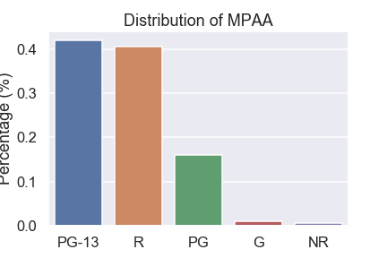

2. Studios 

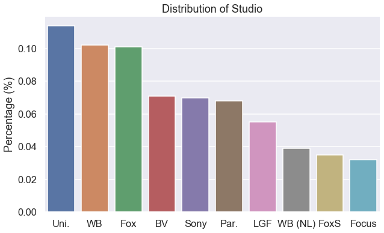

3. Original Language: Original language of 99% of the films in our dataset is English.

4. Budget Distribution

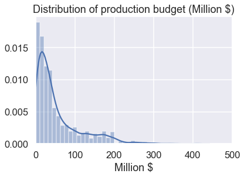

5. Gross Revenue Distribution: Most domestic movies don't yield gross revenue above $200M. But worldwide movies do yield higher revenue. Since it's assuming to be cumulative measure, this is not surprising.  

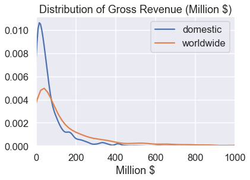

6. Runtime Distribution: Most movies around an hour to 2.5 hrs.

7. Genre Distribution

*Original dataset had animation as a sub-genre, but we considered animation as a separate genre. This is because most animated films are PG or G-rated and this was a key divider of other genres. For example, animated action and non-animated action films tend to show highly different patterns in terms of audience, revenue, production budget, etc.*

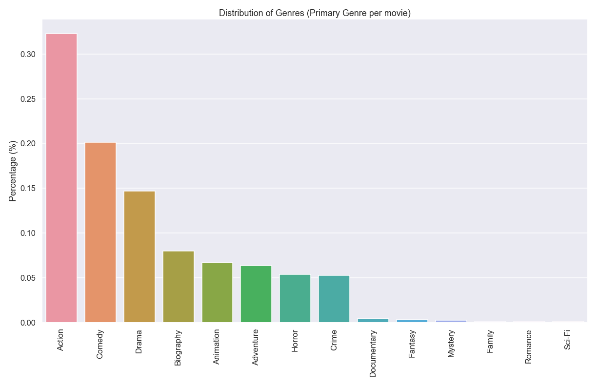

# Process
With building brand presence and long term profit in mind, we explored data and answered our questions as below.

## Understanding the current market. 
### What types of movies have yielded highest revenue?  

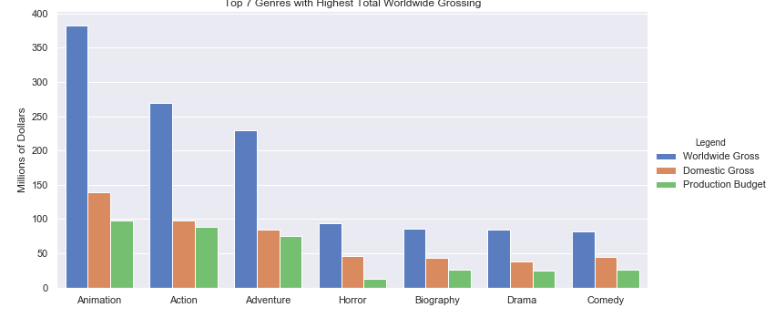

Animation, action and adventure movies on average have high worldwide gross revenue compared to other genres. These genres also have relatively high production budget. 

### Is there any difference in domestic vs. global market in types of movie people consume?

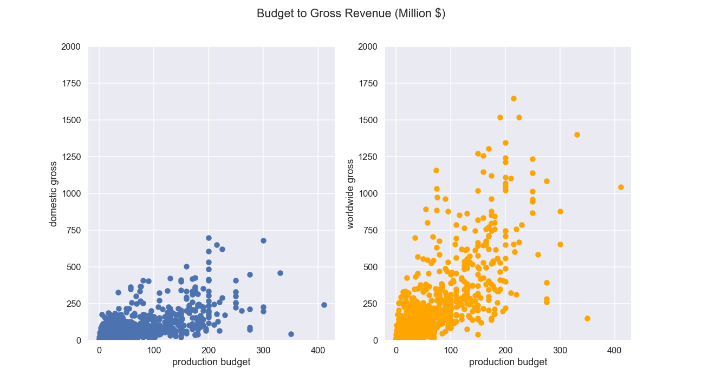

We see here that in the global market, even some of the lower production budget films have a potential of gaining high revenue. Bohemian Rhapsody and Coco are examples of such cases. It's important to note that these films were explicitly targeting the global market with universally common sentiment and worldwidely popular topic.

(Correlation between production budget and worldwide gross is slightly higher (r > 0.77) than that between budget and domestic gross (r > 0.68), but both are significant.)

We also looked at the main cast of each movies to see if they say anything about the worldwide vs. domestic trend difference. But given our dataset is limited to 10 years and individual actors don't have as many movie data to show individual differences beyond the movie differences. So this result speaks to the overall movies than suggesting information about individual actors. Despite the fact, we still included here because we think it holds some meaningful information. We normalized the worldwide gross and domestic gross to compare them on the same scale as we were interested in knowing relative difference in success.

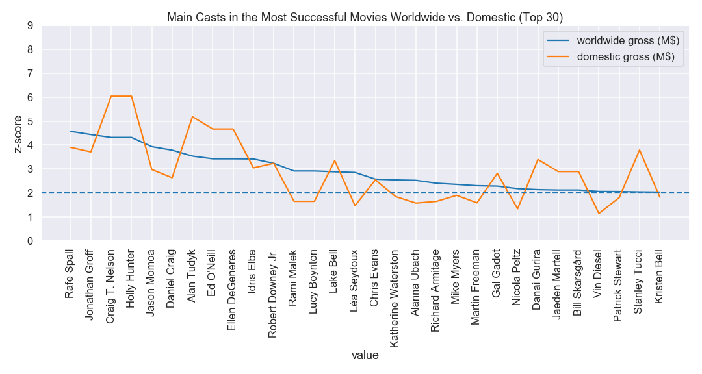

Here we see that top 30 casts are all well above 95th percentile in either market.
But from seeing the success of voice casts in global market relative to domestic market, we can presume animation might have been relatively more successful domestically than other genres.

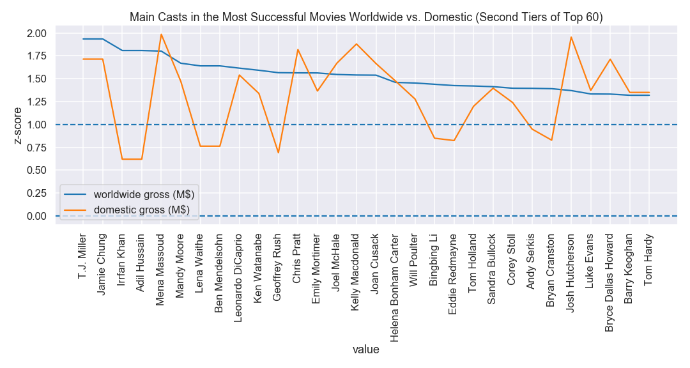

Casts from the movies like Life of Pi, Aladdin, and Ready Player One had shown remarkably more success globally even when their performance was about average for domestic crowd. 

These are top 20 stars whose success in global market is relatively highest compared to that of domestic market. This shows Bollywood as an important market to consider. Combining above points, we recommend investigating more into diversity of represented crowd, 007, music, bollywood, gaming as keywords that might be appealing to the global market.

  
### Is there any change in trend? 

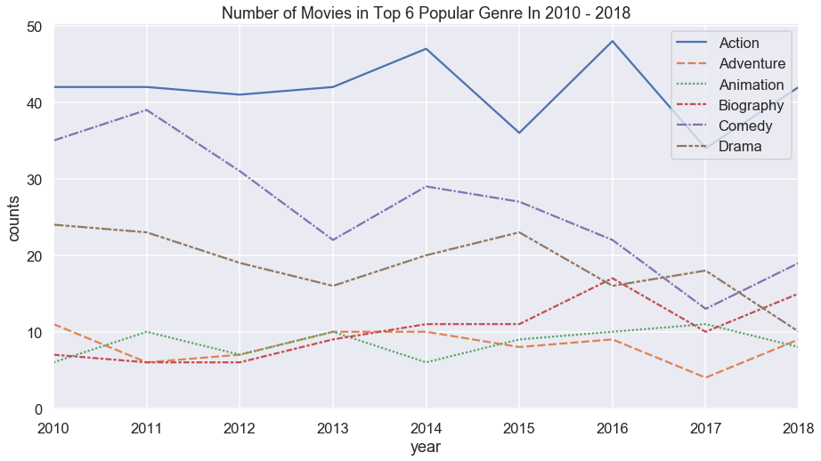

We see that comedy and drama productions have been steadilyly decreasing in the past decade, while biography films are on the rise. How we may react to this trend requires further investigation.  

One suggestion for future analyses is to consider how categorization of movies must adapt to the change of the trend. Our current analyses is limited as we use the predetermined genre categories. Yet, it is evident that more and more movies are having more than one genre and becoming hybrids. Think Joker, breaking the stereotype of action = superhero formula, or the Shape of Water combining romance with creature fantasy.

### What is the reasonable investment to maximize the gain?
Earlier we discussed that action, animation and adventures on average yield highest revenue. But there is a big caveat to consider.  

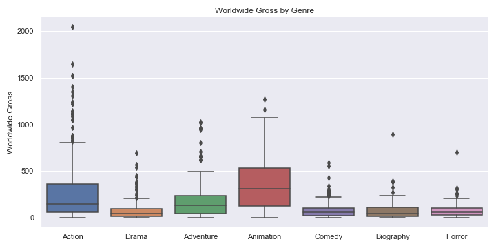

From this boxplot, we can see how majority of action remains on the lower end of the revenue. This, considering the high budget involved in making action films, is rather devastating. Even though action genre is associated with the second highest worldwide revenue, the chance of success is slim. In fact, it is many rare cases with exceptional successes that made up for this high average. 

Majority of these rare successes are Marvel/DC production dominated superhero movies. (10 out of top 20 movies with the highest worldwide revenue are superhero films.) This is the market that's been skyrocketed in the past decade and will be a difficult wall to break as a new studio. 

On the other hand, higher percentage of animation tend to do better than other genres in the global market, making it to be safer investment with mid-to-high budget. 

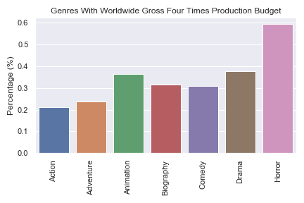

Close to 40% of animated films returned at least 4 times of its production budget, while only about 20% of action movies did. Additionally, more than 85% of the non-action movies that made above $750M worldwide gross revenue with relatively lower budget (less than $200M budget) were animation or live-action based on animation. 

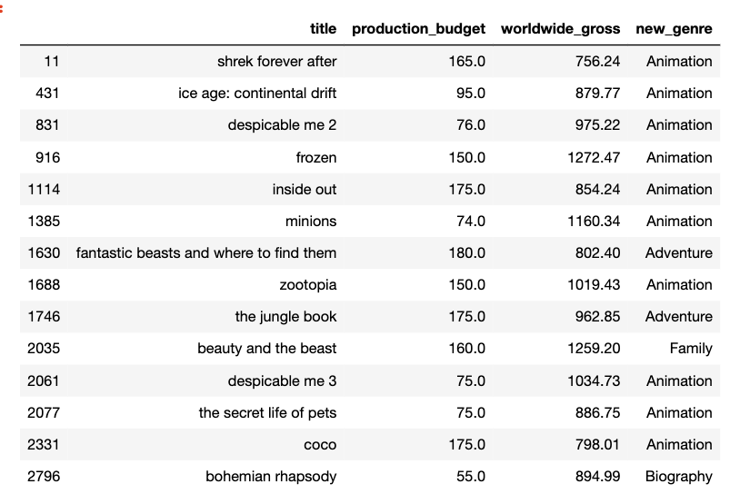

So for the highest return and for domestic and worldwide branding, we recommend targeting animation. 

### But horror movie did better?

If our goal is to simply minimize our risk and start small, horror movies are the best bet. Horror films brought in the most revenue per investment, and requires little budget to start out. 

But we generally want to advise against this approach, because horror films don’t align with the existing Microsoft's brand, and it is not a great path to build a brand because it does not 1. gain popularity (to build fandom) or 2. get highly rated. We will discuss more about popularity and ratings in the virality section.

### What other features may influence the sales?  

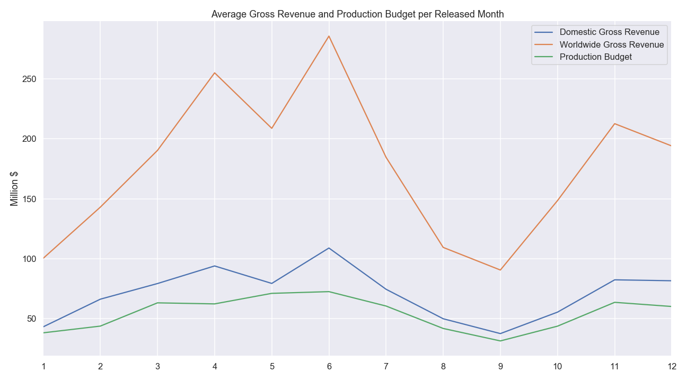

Looking at the annual trend, we can see that movies released in April to June tend to be the highest revenue yielding ones. This would be a great time to release our globally appealing animation and family adventures.

Highly acclaimed movies are released close to the end of the year during the “Oscar Seasons” to maximize their exposures to critics. We recommend releasing our award worthy biography films during this time and elevate our brand to the level of other established studios.

## Understanding virality of movies (for building brand)
### What type of movies or team gets nominated for awards? 
We believe that making quality movies are highly acclaimed and win awards are important in building a sustainable brand. These movies should be stacked with our high-profit yielding family animation to solidify our brand presence in the market. Unfortunately our dataset does not contain award information and we hope to have more accurate measure for awards for the future investigation. Meanwhile, we used IMDB ratings as an indication of film's award-worthiness.

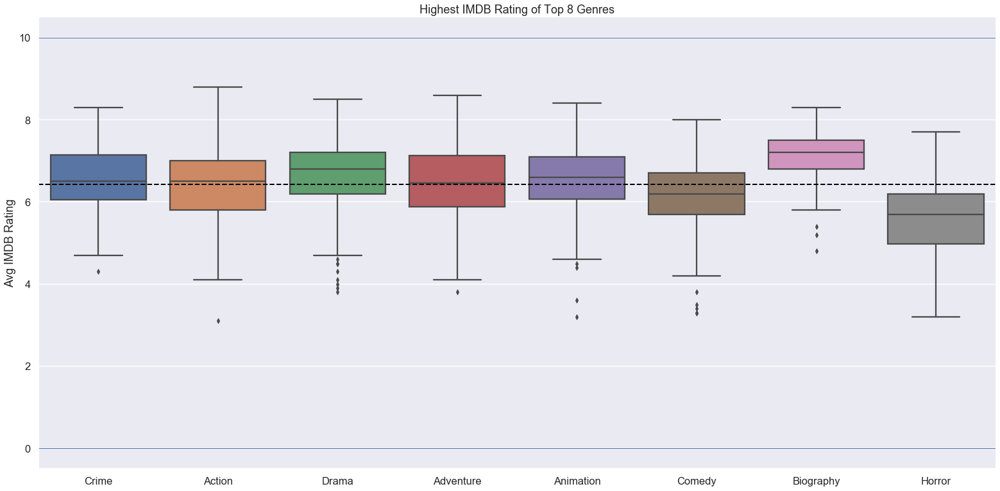

We can see that biography films tend to have higher ratings compared to other genres. In fact, biography films have recently trended to rate high and often are nominated for awards. With films like Bohemian Rhapsody, Rocketman, Selma and the Iron Lady gaining nominations and awards. We believe that combining the biography genre with the globally appealing topics are a feasible market to target.

On the other hand horror movies almost always have the below average ratings. 

### How are the popularity measures relate to the profit?  
Popularity measure from the Movie Database includes multiple variables including the number of votes, number of views, etc. We considered this measure to be a good indicator of virality. (There are certainly better measure of virality that may involve social media api or webscraping.). 

Our data showed that this popularity measure positively and strongly correlates the gross revenue.  

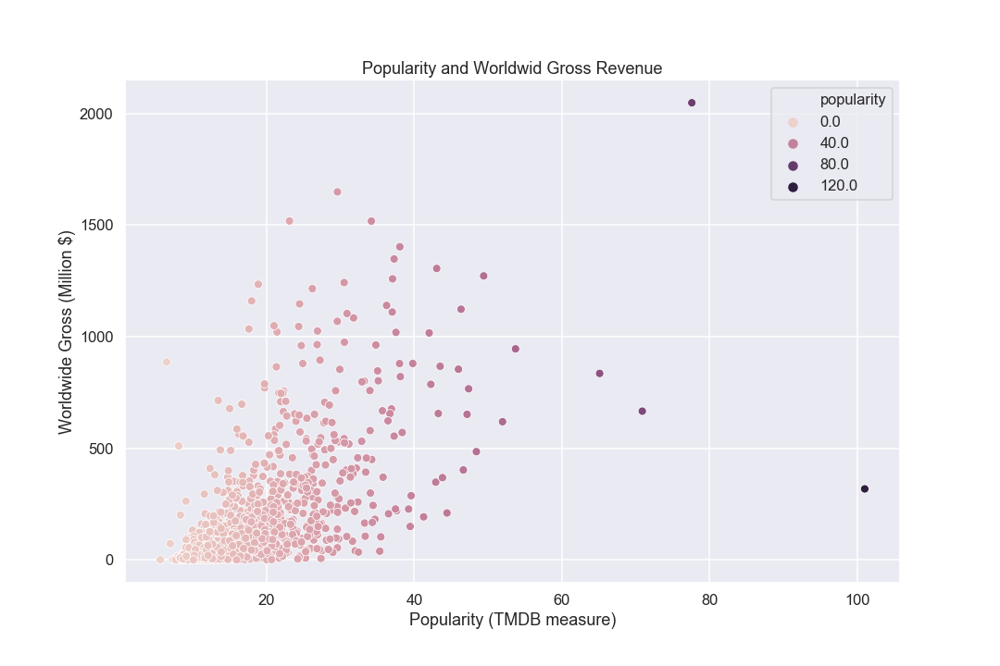

Therefore we recommend further investigation of virality in relation to popularity measures.

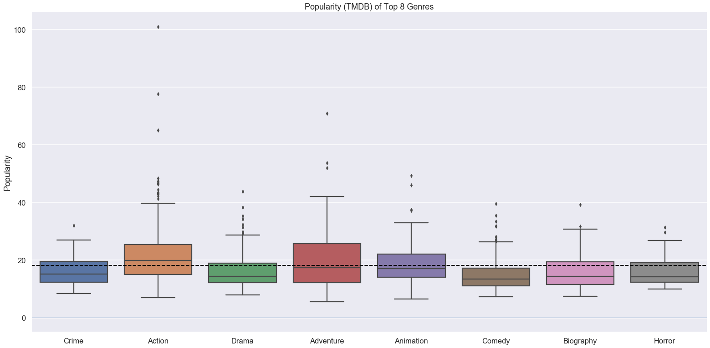

Other than action, adventure, animation most movies are not as popular. For drama and comedy, some movies seem to gain a relatively large popularity. But most comedy, crime and horror films tend to stay in lower tier.

### Are there any topical pattern in successful movies?  
Additionally we were interested in seeing if there are any topical keywords related to the success of the films. For this we took the overview texts of high popularity movies (90th percentile and above, 60 movies) and low popularity movies (10th percentile and below, 60 movies) and counted the most used words. 

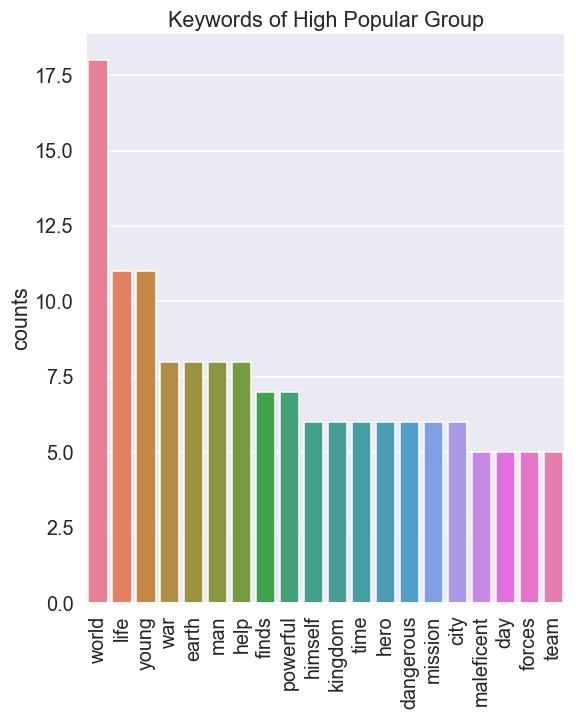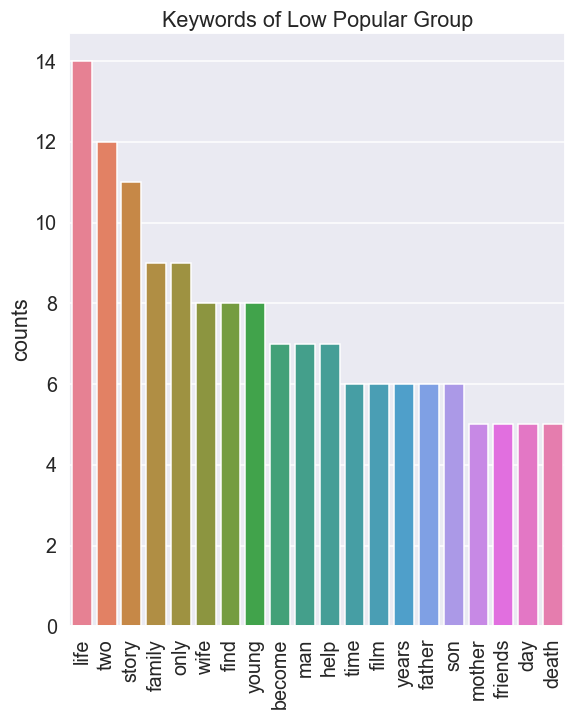  

High popularity group tends to have more macro scale words (e.g. kingdom, world, war, powerful, earth) used than the low popularity group that tend to use micro scale words (e.g. family, two, wife, son).

    

It is certainly not a definitive measure of success as these keywords are biased by unmatched success of superhero action movies, which tend to require more universal descriptors. But further investigation of this sort may reveal more insight into understanding topical virality in film consumption.

# Conclusion
We reviewed the movie data from the past decade to propose a few recommendation and guideline to start a movie studio. Our focus was on building a sustainable brand by focusing on virality and targeting the global market. We looked at the current market in terms of budget, revenue, and compared global market and domestic market. We reviewed the change of trend and proposed some reasonable investment choices to reach our goal. An annual plan to synergize productions of two separate lines of films (profitable animation and award-worthy biography) was suggested. Additionally we looked at keywords associated with the popularity of films. Throughout, we also posed a couple limitations in our approach that require further investigation of the data.

# Recommendations
1. Explicitly target global market
	Investigate deeper into keywords such as diversity, music, gaming and bollywood
2. Invest in animation or adventure films for all ages to maximize gains and expand the brand presence
3. Make lower-budget biography films targeting award nomination to elevate the brand image

